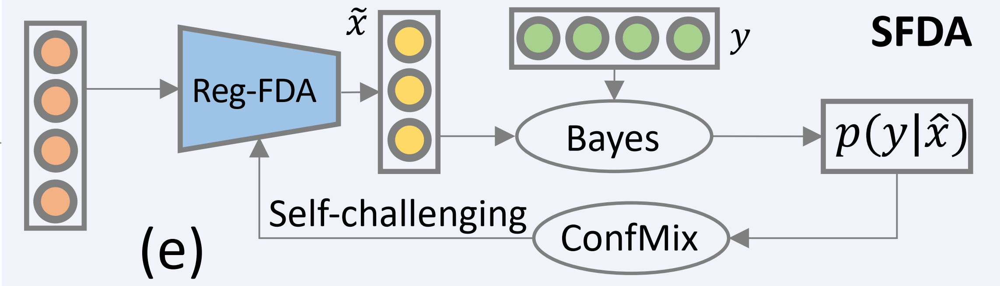

<html xmlns="http://www.w3.org/1999/xhtml" xml:lang="en"> 
<body>
<head>
<meta name="keywords" content="Wenqi Shao, CUHK" />
<meta http-equiv="Content-Type" content="text/html;charset=utf-8" />
<link rel="stylesheet" href="jemdoc.css" type="text/css" />
<!--link rel="shortcut icon" href="rui.ico"-->
<title>Hongsheng Li at CUHK</title>
</head>

<h2>
  Biography 
</h2>

 
I am a Research Scientist at Shanghai AI Lab. I got my Ph.D. degree from Multimedia Lab, the Chinese University of Hong Kong in 2022. During my Ph.D. period, I was supervised by <a href="https://www.ee.cuhk.edu.hk/~xgwang/">Prof. Xiaogang Wang</a>, <a href="http://luoping.me/">Prof. Ping Luo</a>, and <a href="https://www.ee.cuhk.edu.hk/~hsli/">Prof. Hongsheng Li</a>. I was fortunate to involve several interships in industry, such as Tencent ARC, Huawei Noah AI Foundation Group, and Sensetime Research. My research interests lie in transfer learning of foundation models, co-design of networks and hardware accelerator, normalization methods in deep models, self-supervised representation learning. 

 
<i> I am looking for research interns at Shanghai AI lab. Feel free to send me an email if you are interested in the above topics. </i>

<!-- News
======
[06/2022] SFDA was accepted by ECCV 2022.
-->

<h2>
  News 
</h2>
<ul>
  <li>
    
 [08/2022] Congrats! I have passed Ph.D Oral Defense.
    

  </li>

  <li>
    
 [06/2022] An effective model selection method <a href="https://arxiv.org/abs/2207.03036"> <b>SFDA</b></a> was accepted to ECCV 2022
    

  </li>

  <li>
    
 [06/2022] An self-supervised framework for point cloud in autonomous driving <a href="https://arxiv.org/abs/2206.04028"> <b>CO3</b></a> was released.
    

  </li>

  <li>
    
 [01/2022] A normalization method <a href="https://arxiv.org/abs/2112.02624"> <b>DTN</b></a> for ViTs was accepted to ICLR 2022.
    

  </li>

  <li>
    
 [08/2021] Theoretical analysis for channel pruning <a href="https://proceedings.neurips.cc/paper/2021/hash/87ae6fb631f7c8a627e8e28785d9992d-Abstract.html"> <b>CWDA</b></a> was accepted to NeurIPS 2021.
    

  </li>

</ul>

<h2> Publications</h2>
<table id="tbPublications" width="100%">
	<tbody>
	<tr>
	<td>

</td>
	 <td>
		Not All Models Are Equal: Predicting Model Transferability in a Self-challenging Fisher Space,
		 
    <i><b>Wenqi Shao</b>, Xun Zhao, Yixiao Ge, Zhaoyang Zhang1, Lei Yang, Xiaogang Wang, Ying Shan, Ping Luo</i>
		 
		European Conference on Computer Vision (<b>ECCV</b>) 2022
		 
			[<a href='https://arxiv.org/abs/2207.03036' target="_blank"><b>paper</b></a>|<a href='https://github.com/TencentARC/SFDA' target="_blank"><b>code</b></a>]
	 </td>
  </tr>

</tbody></table>

</body>
</html>
